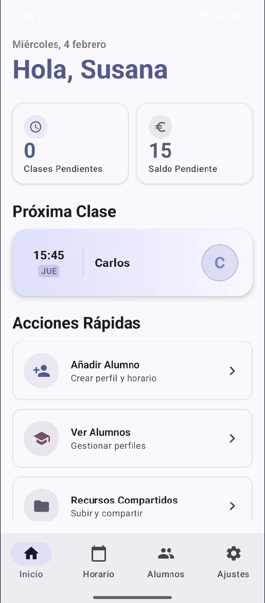
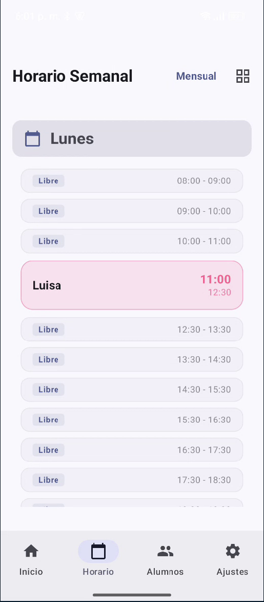
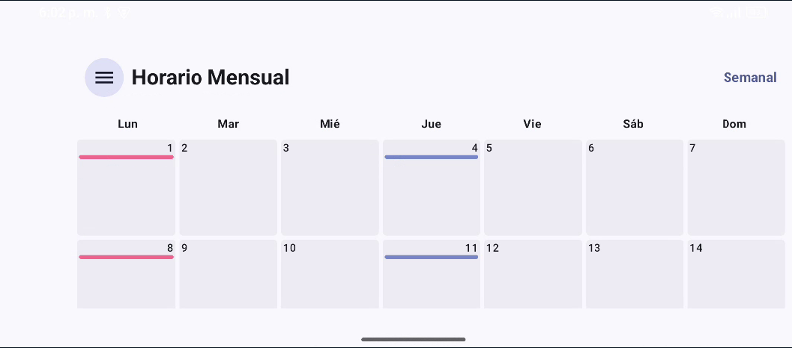
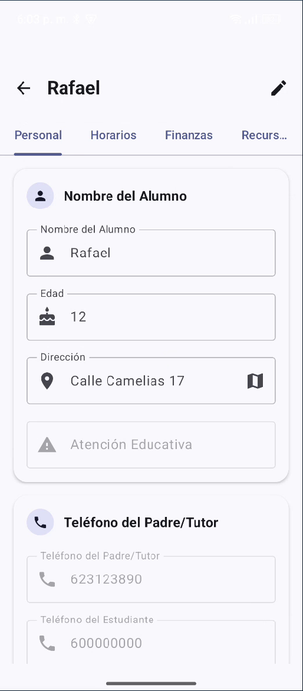
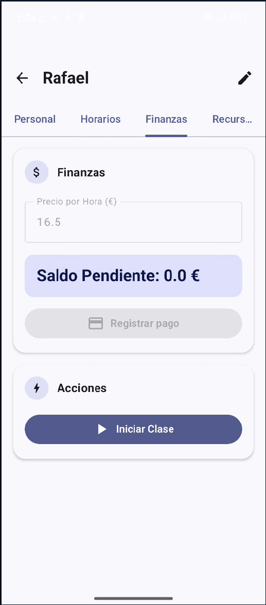
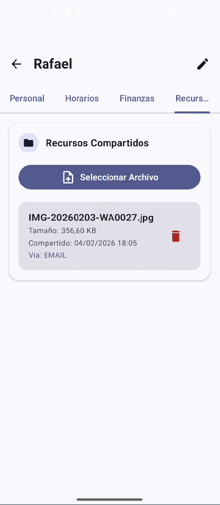

  

  

<h1 align="center">HomeTutorPro</h1>

  
  

  <strong>Gestión Educativa Inteligente y Segura</strong> 
  Una solución integral para tutores modernos construida con Clean Architecture y Jetpack Compose.

---

## ✨ Características Principales

* **👥 Gestión de Alumnos:** Perfiles con historial y contacto.
* **📅 Horario Inteligente:** Vistas semanales y mensuales para control total.
* **💰 Control Financiero:** Seguimiento de saldos y precios por hora.
* **📂 Recursos Compartidos:** Gestión de archivos y materiales en la nube.
* **🔒 Seguridad:** Base de datos local cifrada con SQLCipher.
* **🌍 Multi-idioma:** Soporte completo para Español e Inglés.

## 📸 Screenshots

| Dashboard Principal | Horario Semanal | Calendario Mensual |
| :---: | :---: | :---: |
|  |  |  |

| Perfil Estudiante | Gestión Financiera | Recursos Cloud |
| :---: | :---: | :---: |
|  |  |  |

## 🏗️ Arquitectura y Tech Stack

El proyecto utiliza **Clean Architecture** con **MVVM** y **UDF** (Unidirectional Data Flow).

* **UI:** Jetpack Compose para una interfaz moderna y reactiva.
* **DI:** Hilt para inyección de dependencias.
* **DB:** Room con cifrado SQLCipher (Soporte Android 15+).
* **Backend:** Firebase (Auth, Firestore, Storage).
* **Testing:** Suite de +150 tests (Unitarios e Instrumentados).

## 🚀 Instalación

1. Clona el repositorio.
2. Añade tu `google-services.json` de Firebase en `/app`.
3. Sincroniza Gradle y ejecuta el proyecto.
3.  Sincroniza el proyecto con Gradle en Android Studio.
4.  Ejecuta la variante de `debug` en tu emulador o dispositivo físico.
