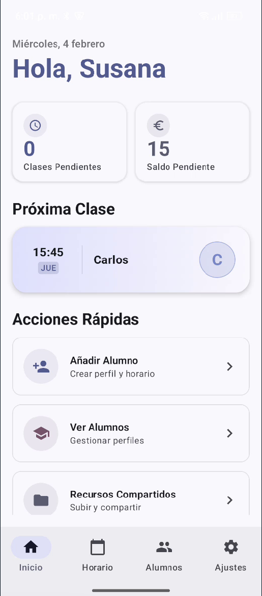
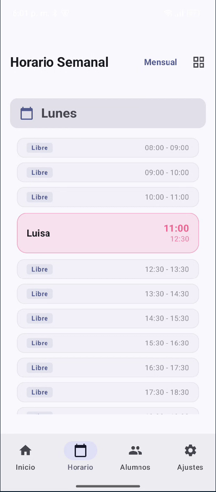
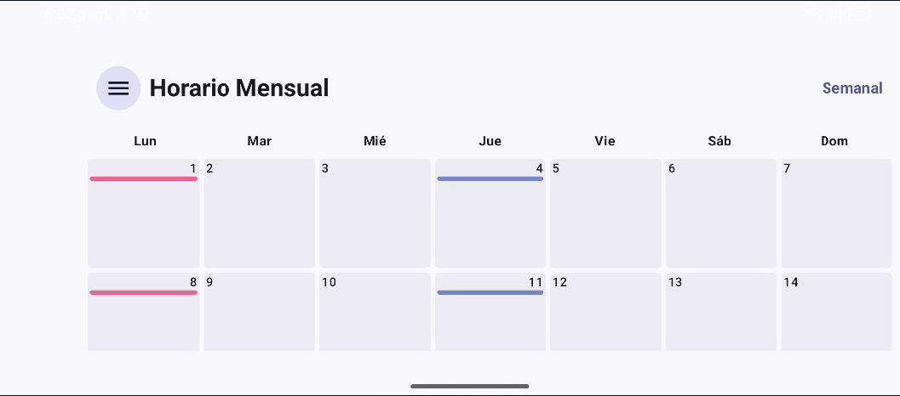
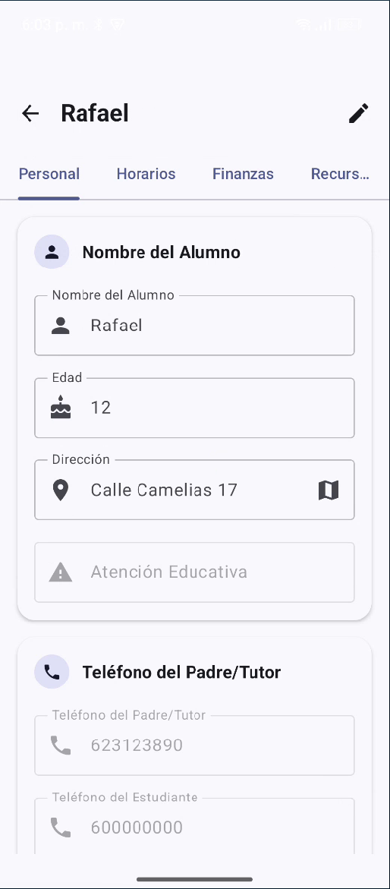
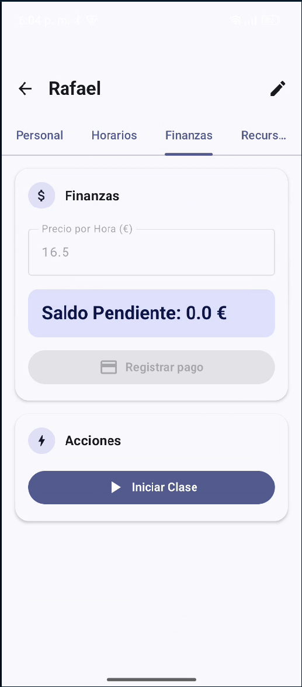
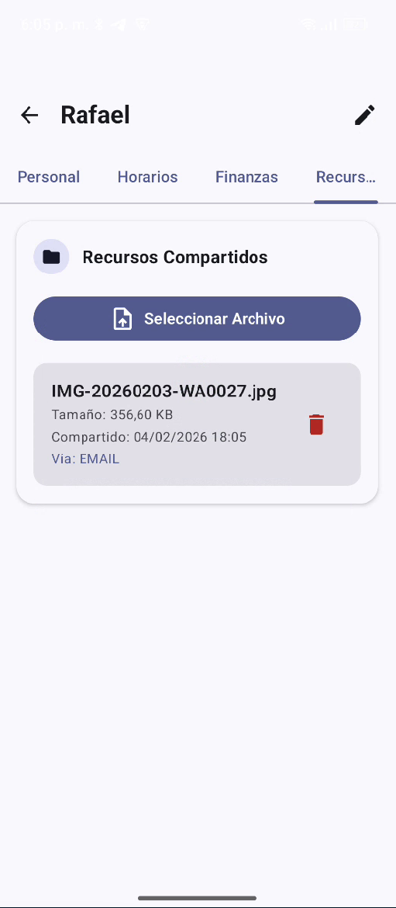

<p align="center">
  
</p>

<h1 align="center">HomeTutorPro</h1>

<p align="center">
  <a href="#"></a>
  <a href="#"></a>
  <a href="#"></a>
</p>

<p align="center">
  <strong>Productividad real para profesores a domicilio</strong><br>
  Aplicación mobile construida con arquitectura moderna, foco en mantenibilidad y casos de uso reales.
</p>

---

## ✨ Características Principales

* **👥 Gestión de Alumnos:** Perfiles completos con contacto, materias, direcciones y notas.
* **📅 Agenda y Horarios:** Vistas diarias y semanales optimizadas para trabajo en movilidad.
* **🧭 Navegación Integrada:** Acceso directo a direcciones con Google Maps.
* **📂 Materiales y Recursos:** Gestión de PDFs, documentos e imágenes por alumno.
* **💰 Pagos y Asistencia:** Seguimiento de clases, tarifas y estado de pagos.
* **📨 Comunicación Rápida:** Accesos directos a WhatsApp y email por alumno.
* **📴 Offline-first:** Uso completo sin conexión con sincronización posterior.

---

## 📸 Screenshots


| Dashboard Principal | Horario Semanal | Calendario Mensual |
| :---: | :---: | :---: |
|  |  |  |

| Perfil Estudiante | Gestión Financiera | Recursos Cloud |
| :---: | :---: | :---: |
|  |  |  |

---

## 🏗️ Arquitectura

El proyecto sigue **Clean Architecture + MVVM**, diseñado como una app real de producción, no como demo.

```text
app
│
├── core
│ ├── common
│ ├── design-system
│ ├── navigation
│ └── data
│
├── features
│ ├── students
│ ├── schedule
│ ├── payments
│ ├── materials
│ └── settings
│
└── build-logic
```

### Capas

* **UI:** Jetpack Compose + ViewModels
* **Domain:** Casos de uso y reglas de negocio
* **Data:** Repositorios, fuentes de datos y persistencia

Cada feature está verticalmente segmentada para:
- Máxima testabilidad
- Aislamiento
- Evolución independiente

---

## 🧩 Tech Stack

* **Lenguaje:** Kotlin
* **UI:** Jetpack Compose
* **Arquitectura:** Clean Architecture + MVVM
* **Async:** Coroutines + Flow
* **DI:** Hilt
* **Persistencia:** Room / DataStore
* **Navegación:** Compose Navigation
* **Testing:** JUnit, MockK, Turbine
* **Build:** Gradle (Version Catalogs + Convention Plugins)

---

## 🚀 Instalación

1. Clona el repositorio.
2. Abre el proyecto en Android Studio.
3. Sincroniza Gradle.
4. Ejecuta la variante `debug` en emulador o dispositivo físico.

---

## 🛣 Roadmap

### Fase 1 — Core
- Gestión de alumnos
- Agenda diaria y semanal
- Persistencia local
- Navegación

### Fase 2 — Productividad
- Pagos y asistencia
- Materiales por alumno
- Búsqueda y filtros

### Fase 3 — Inteligencia
- Detección de conflictos
- Recordatorios
- Sugerencias de planificación

### Fase 4 — IA
- Añadir agente interno que ayude a la gestión

### Fase 5 — MULTIPLATAFORMA
- VERSIÓN PARA iOS
---

## 🧠 Por qué existe este proyecto

Este proyecto no es un juguete.

Existe para:
- Modelar arquitectura Android realista y mantenible
- Explorar modularización escalable
- Simular decisiones técnicas guiadas por producto
- Servir como referencia de apps de producción modernas

---

## 🚧 Estado del proyecto

En desarrollo activo.  
Se esperan cambios estructurales conforme evolucionen los requisitos reales del producto.

---

## 📄 Licencia

MIT License
